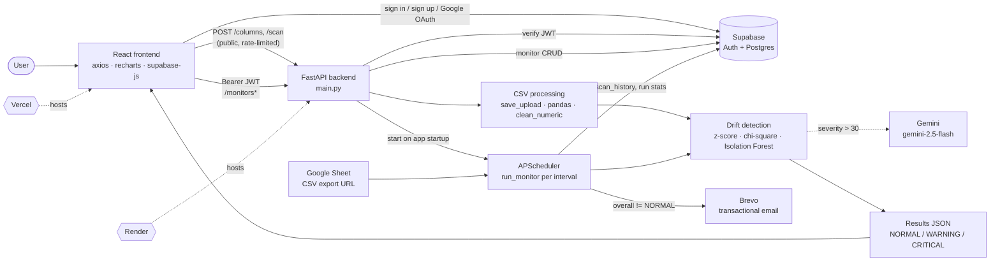

<!--#  DriftWatch

**AI-powered data quality monitoring for teams who care about their data.**

[](https://driftwatchai.vercel.app/)
[](https://driftwatch-backend.onrender.com/)
[](https://driftwatch-backend.onrender.com/docs)
[](https://github.com/user1-prajwal)

---

## What is DriftWatch?

DriftWatch automatically watches your data sources, detects statistical anomalies using an ensemble of three ML models, and sends a plain-English email explaining what happened and why — before it becomes a business problem.

**Two ways to use it:**

- **One-time scan** — upload any CSV directly in the hero section of the landing page. No login required. Results appear inline, instantly.
- **Auto monitor** — connect a Google Sheet once, set a schedule, and DriftWatch watches it continuously. Email alerts fire only when something actually needs attention.

---

## Live Demo

**→ [https://driftwatchai.vercel.app/](https://driftwatchai.vercel.app/)**

> Backend runs on Render free tier. First request after inactivity may take ~30 seconds to wake up.

**Try it instantly — no account needed:**

The scan tool is embedded directly on the landing page. Upload this sample file to see a live anomaly detection result:

```csv
date,daily_sales,orders,returns
2024-01-01,45000,120,5
2024-01-02,47000,125,4
2024-01-03,44000,118,6
2024-01-04,46000,122,5
2024-01-05,48000,128,4
2024-01-06,45500,121,5
2024-01-07,47500,126,4
2024-01-08,46000,123,5
2024-01-09,45000,119,6
2024-01-10,47000,124,4
2024-01-11,46500,122,5
2024-01-12,8000,12,45
```

Save as `test_data.csv`. The last row is the anomaly — sales crashed, orders dropped, returns spiked. DriftWatch will catch all three and explain each one.

---

## How It Works

```
CSV upload or Google Sheet
         ↓
clean_numeric() strips commas, currency symbols
converts "45,000" → 45000 before analysis
         ↓
Three ML detectors run in parallel
         ↓
Gemini AI generates plain-English explanation
         ↓
Health score (0–100) computed from combined signals
         ↓
Email alert fires only if anomaly found
User sees: what changed · why · what to do
```

---

## Detection Engine

DriftWatch runs three detectors on every scan and combines their outputs into a single health score.

### Z-Score Detector
For numeric columns. Measures how many standard deviations the latest value sits from the historical mean. Flags columns that drift outside the expected range.

```
daily_sales: baseline mean = ₹46,125 ± ₹1,240
Today's value: ₹8,000
Z-score: −30.7 → CRITICAL
Change: 📉 82.7% below usual
```

### Chi-Square Detector
For categorical columns. Compares today's value distribution against the historical baseline using a chi-square test. Catches sudden shifts in category mix.

```
API status — baseline: success 80%, failed 10%, pending 10%
Today:                 success 10%, failed 80%, pending 10%
P-value: 0.0004 → CRITICAL distribution shift
```

### Isolation Forest
For row-level anomalies across multiple columns simultaneously. A row can look normal in each individual column but still be statistically impossible when all columns are considered together.

```
teachers_present: 16   (normal range: 15–18)
classes_held:      1   (normal range: 7–9)
students_present: 12   (normal range: 420–470)

Each column looks borderline alone.
Together: row-level anomaly → CRITICAL
```

### Health Score
All three detector signals are combined into a single 0–100 health score per scan:

```
80–100  Healthy
60–79   Fair
40–59   Degraded
0–39    Critical Drift
```

---

## System Architecture

```
┌──────────────────────────────────────────────────────────┐
│                     FRONTEND (React)                     │
│                                                          │
│  Landing page with embedded scan tool (no login)         │
│  Auto monitors dashboard (login required)                │
│  Run history · metric trend chart · status donut         │
│  Scan history table with expandable row details          │
│                                                          │
│  Vercel · supabase-js · axios · Recharts                 │
└───────────────────────┬──────────────────────────────────┘
                        │ REST API
                        │ JWT token on protected routes
┌───────────────────────▼──────────────────────────────────┐
│                   BACKEND (FastAPI)                      │
│                                                          │
│  Public routes     │  Protected routes (JWT required)    │
│  ─────────────     │  ──────────────────────────────     │
│  POST /scan        │  POST   /monitors                   │
│  POST /columns     │  GET    /monitors                   │
│  GET  /health      │  POST   /monitors/{id}/run          │
│                    │  POST   /monitors/{id}/pause         │
│                    │  POST   /monitors/{id}/resume        │
│                    │  DELETE /monitors/{id}               │
│                    │  GET    /monitors/{id}/history       │
│                                                          │
├──────────────────────────────────────────────────────────┤
│                    ML ENGINE                             │
│                                                          │
│  detector.py                                             │
│  ├── clean_numeric()       text-number preprocessing     │
│  ├── check_numeric_column()      Z-score detector        │
│  ├── check_category_column()  Chi-square detector        │
│  ├── check_isolation_forest()    IF detector             │
│  └── explain_with_gemini()   Gemini AI explanation       │
│                                                          │
├──────────────────────────────────────────────────────────┤
│                   SCHEDULER                              │
│                                                          │
│  APScheduler (BackgroundScheduler)                       │
│  ├── Loads all active monitors on startup                │
│  ├── Fetches Google Sheet via CSV export URL             │
│  ├── Runs full detector pipeline                         │
│  ├── Sends email via Brevo API if anomaly found          │
│  └── Saves result to scan_history table                  │
│                                                          │
│  Render (Python)                                         │
└───────────────────────┬──────────────────────────────────┘
                        │
┌───────────────────────▼──────────────────────────────────┐
│                    SUPABASE                              │
│                                                          │
│  PostgreSQL                                              │
│  ├── monitors      (user_id FK · RLS enabled)            │
│  └── scan_history  (monitor_id FK · RLS enabled)         │
│                                                          │
│  Auth                                                    │
│  ├── Email + password                                    │
│  └── Google OAuth2                                       │
│                                                          │
│  Row Level Security                                      │
│  └── Data isolation enforced at database level           │
│      auth.uid() = user_id on every query                 │
└──────────────────────────────────────────────────────────┘
```

---

## Security

Data isolation is enforced at two independent levels.

**Application level** — every protected route verifies the JWT token. The `user_id` is always extracted from the verified token, never from the request body. A user cannot reference another user's monitor ID.

**Database level** — Supabase Row Level Security policies mean the database itself enforces isolation:

```sql
create policy "Users see own monitors"
  on monitors for all
  using (auth.uid() = user_id);

create policy "Users see own history"
  on scan_history for all
  using (auth.uid() = user_id);
```

Even if there were a bug in the application code, the database would not return another user's data.

**Stateless scans** — one-time scans run entirely in memory. No data is written to the database. The uploaded file is deleted from the server immediately after the scan completes.

---

## Key Design Decisions

| Decision | Reasoning |
|----------|-----------|
| Scan tool embedded in hero section | Zero friction — users see value before they sign up, with no navigation required |
| Auth required only for auto monitors | One-time scans are stateless and need no account; monitoring requires persistence |
| Google Sheets only for auto monitors | Local CSV paths are inaccessible from a deployed server; Sheets work from anywhere |
| `clean_numeric()` preprocessing | Google Sheets stores formatted numbers like "45,000" as text strings; this converts them before ML runs |
| Plain English output | Statistical terms like Z-score and p-value are abstracted away completely from the user-facing output |
| Email only on anomaly | Silent normal scans reduce noise; alerts mean something needs attention |
| Sensitivity levels | Different datasets have different tolerance thresholds; users choose Low, Medium, or High in plain language |
| Scan history in PostgreSQL | Enables the run history graph, trend charts, and filterable history table in the monitor dashboard |

---

## Known Limitations and Production Considerations

**APScheduler on Render free tier** — the scheduler runs inside the FastAPI process. On a multi-instance deployment, each instance would run the same job independently. For production scale, this would migrate to a distributed task queue (Celery + Redis) or a managed cron service.

**Render free tier sleep** — the server sleeps after 15 minutes of inactivity. A health check ping service (UptimeRobot) keeps it awake for demo purposes. A paid instance would eliminate this entirely.

**Gemini on the critical path** — currently the AI explanation blocks the scan response. A more resilient architecture would detect and save the anomaly first, send the alert, then generate the explanation asynchronously. Gemini downtime would not affect detection.

---

## Tech Stack

| Layer | Technology |
|-------|-----------|
| Frontend | React, Recharts, Axios |
| Backend | Python, FastAPI, Uvicorn |
| ML | scikit-learn (Isolation Forest), scipy (Z-score, chi-square), pandas |
| AI | Google Gemini 1.5 Flash |
| Auth | Supabase Auth — email/password + Google OAuth2 |
| Database | Supabase PostgreSQL + Row Level Security |
| Scheduler | APScheduler BackgroundScheduler |
| Email | Brevo Transactional Email API |
| Data source | Google Sheets CSV export |
| Deploy | Vercel (frontend) · Render (backend) |

---

## Run Locally

**Prerequisites:** Python 3.10+, Node.js 18+, Supabase account, Gemini API key (free), Brevo API key (free)

### Backend

```bash
git clone https://github.com/user1-prajwal/driftwatch.git
cd driftwatch/backend

pip install -r requirements.txt

# Copy and fill in environment variables
cp .env.example .env

python -m uvicorn main:app --reload
# http://localhost:8000
# http://localhost:8000/docs  ← interactive API docs
```

### Frontend

```bash
cd driftwatch/frontend
npm install

# Create frontend .env
echo "REACT_APP_SUPABASE_URL=your_supabase_url" > .env
echo "REACT_APP_SUPABASE_ANON_KEY=your_anon_key" >> .env

npm start
# http://localhost:3000
```

### Environment Variables

**`backend/.env`**
```
GEMINI_API_KEY=
BREVO_API_KEY=
BREVO_SENDER_EMAIL=
BREVO_SENDER_NAME=DriftWatch
SUPABASE_URL=
SUPABASE_ANON_KEY=
SUPABASE_SERVICE_KEY=
```

**`frontend/.env`**
```
REACT_APP_SUPABASE_URL=
REACT_APP_SUPABASE_ANON_KEY=
```

### Database (Supabase SQL Editor)

```sql
-- Monitors table
create table monitors (
  id              uuid default gen_random_uuid() primary key,
  user_id         uuid references auth.users(id) on delete cascade,
  name            text not null,
  source_type     text not null,
  source_value    text not null,
  date_column     text not null,
  context         text not null,
  sensitivity     text default 'medium',
  alert_email     text not null,
  interval_hours  integer not null,
  monitor_columns text default '',
  status          text default 'active',
  created_at      timestamptz default now(),
  last_run        timestamptz,
  last_status     text,
  total_runs      integer default 0,
  total_alerts    integer default 0
);

alter table monitors enable row level security;
create policy "Users see own monitors"
  on monitors for all using (auth.uid() = user_id);

-- Scan history table
create table scan_history (
  id              uuid default gen_random_uuid() primary key,
  monitor_id      uuid references monitors(id) on delete cascade,
  user_id         uuid references auth.users(id) on delete cascade,
  scanned_at      timestamptz default now(),
  overall_status  text not null,
  total_columns   integer default 0,
  critical_count  integer default 0,
  warning_count   integer default 0,
  normal_count    integer default 0,
  column_results  jsonb,
  alert_sent      boolean default false
);

alter table scan_history enable row level security;
create policy "Users see own history"
  on scan_history for all using (auth.uid() = user_id);

create index scan_history_monitor_id_idx on scan_history(monitor_id);
create index scan_history_scanned_at_idx on scan_history(scanned_at desc);
```

---

## Project Structure

```
driftwatch/
├── backend/
│   ├── main.py              FastAPI app, all API routes
│   ├── detector.py          ML engine — Z-score, chi-square, Isolation Forest
│   ├── scheduler.py         APScheduler, Google Sheets fetcher, scan runner
│   ├── monitors.py          Supabase CRUD for monitors table
│   ├── alerts.py            Brevo email alert sender
│   ├── auth.py              JWT verification middleware
│   ├── supabase_client.py   Supabase anon + service role clients
│   ├── requirements.txt
│   └── data/                Temporary scan files (auto-deleted)
│
└── frontend/
    └── src/
        ├── App.js            Landing page, embedded scan tool, routing
        ├── MonitorsPage.js   Full monitor dashboard with charts
        ├── ScanPage.js       Standalone one-time scan flow
        ├── AuthModal.js      Login / signup modal
        └── supabaseClient.js Supabase JS client initialisation
```

---

## Author

[](https://linkedin.com/in/user1-prajwal451)
[](https://github.com/user1-prajwal)
-->
# DriftWatch — Data Anomaly Monitoring Platform

Detect unusual changes in tabular data and get a plain-English explanation of what changed. Upload a CSV for a one-off scan, or connect a Google Sheet and let DriftWatch check it on a schedule and email you when something looks wrong.

[Live demo](https://driftwatchai.vercel.app/) · [Backend API docs](https://driftwatch-backend.onrender.com/docs) · [Interactive architecture map](docs/architecture-map.html)

> The backend runs on Render's free tier, so the first request after a period of inactivity can take about 30 seconds.

## What it does

- **One-time scan (no login).** Upload a CSV on the landing page and get results inline. Nothing is saved, and the uploaded file is deleted when the scan finishes.
- **Auto monitors (login required).** Connect a Google Sheet, choose columns, sensitivity and an interval in hours. Each run is stored in scan history. An email alert is sent only when the overall result is not NORMAL.
- **Plain-English explanations.** Findings with severity above 30 are explained by Gemini (what changed, why it may matter, what to do). Statistical terms stay out of the headline results.

## How a scan works

DriftWatch judges the **latest row (or latest date) against the history before it.** Your data must therefore be ordered oldest to newest; the code does not sort it.

1. **Upload and validation.** CSV only, 50 MB cap, rate-limited. The file is stored under a server-generated name.
2. **Cleaning.** `clean_numeric()` converts text numbers such as `"45,000"` or currency-formatted values to real numbers.
3. **Detection.** For each monitored column, in sequence:
   - **Numeric columns, z-score.** The latest value is compared with the mean and standard deviation of earlier rows. Needs at least 2 history values and a non-zero standard deviation.
   - **Categorical columns, chi-square.** The category mix on the latest date is compared with the combined mix of earlier dates (`scipy.stats.chi2_contingency`).
   - **Row-level, Isolation Forest.** Runs once across all numeric columns when there are at least 2 numeric columns and 10 history rows (100 trees, fixed seed, training sample capped at 50,000 rows). It reports the three columns that deviate most.
4. **Explanation.** Results with severity above 30 are sent to `gemini-2.5-flash`. If the call fails, the error is logged and the result is returned without an explanation.
5. **Response.** Each column is labelled NORMAL, WARNING or CRITICAL, plus an overall status for the scan.

### Sensitivity

| Level | Z-score warning / critical | Chi-square p-value warning / critical | Isolation Forest contamination |
|---|---|---|---|
| Low | 3.0 / 5.0 | 0.01 / 0.001 | 0.05 |
| Medium | 2.0 / 3.0 | 0.05 / 0.01 | 0.10 |
| High | 1.0 / 2.0 | 0.10 / 0.05 | 0.15 |

### Health score

The health score is calculated **in the frontend** from the backend's statuses; it is not a backend field.

- **One-time scan:** `100 − 25 per CRITICAL − 12 per WARNING − 20 per ERROR`, floored at 0. Labels: 80–100 Healthy, 60–79 Fair, 40–59 Degraded, below 40 Critical drift.
- **Monitor dashboard:** the average of recent runs, where NORMAL counts 1, WARNING 0.5 and CRITICAL 0.

### Try it

Save as `test_data.csv` and upload it. The last row is the anomaly: sales and orders crash while returns spike.

```csv
date,daily_sales,orders,returns
2024-01-01,45000,120,5
2024-01-02,47000,125,4
2024-01-03,44000,118,6
2024-01-04,46000,122,5
2024-01-05,48000,128,4
2024-01-06,45500,121,5
2024-01-07,47500,126,4
2024-01-08,46000,123,5
2024-01-09,45000,119,6
2024-01-10,47000,124,4
2024-01-11,46500,122,5
2024-01-12,8000,12,45
```

## Architecture

Every box and arrow below comes from the code. For an animated version with node tracing, a guided walkthrough and export options, open [`architecture-live`](https://driftwatch-arc.netlify.app/) in a browser.



### Backend routes

| Route | Auth | Purpose |
|---|---|---|
| `GET /health` | none | Health check |
| `POST /scan` | none, 10/min per IP | One-off scan, stateless |
| `POST /columns` | none, 30/min per IP | List columns of an uploaded CSV |
| `POST /monitors` | JWT | Create a monitor and schedule it |
| `GET /monitors`, `GET /monitors/{id}` | JWT | List or read your monitors |
| `POST /monitors/{id}/run` | JWT | Run a monitor now |
| `POST /monitors/{id}/pause`, `/resume` | JWT | Pause or resume scheduling |
| `DELETE /monitors/{id}` | JWT | Delete a monitor |
| `GET /monitors/{id}/history` | JWT | Recent scan history (`?limit=`) |

Rate limits and the upload cap are configurable through `RATE_LIMIT_SCAN`, `RATE_LIMIT_COLUMNS` and `MAX_UPLOAD_MB`.

## Security

- **Authentication.** Protected routes validate the Supabase JWT. The `user_id` always comes from the verified token, never from the request body.
- **Authorization.** Monitor and history endpoints look the monitor up by `(monitor_id, user_id)` before returning or changing anything. The backend talks to Supabase with the **service-role key**, which bypasses Row Level Security, so isolation on this path is enforced by those application-level filters.
- **Row Level Security.** The SQL below also enables RLS policies (`auth.uid() = user_id`). They protect any direct access made with the anon key, such as from the browser.
- **Public endpoint hardening.** CSV-only, size-capped streaming upload, per-IP rate limiting, server-generated temp filenames (the client filename is never used in a path), temp file deleted after each scan.

## Tech stack

| Layer | Technology |
|---|---|
| Frontend | React 19 (Create React App), axios, Recharts, lucide-react, supabase-js |
| Backend | Python, FastAPI, Uvicorn, slowapi (rate limiting) |
| Detection | pandas, scipy (chi-square), scikit-learn (Isolation Forest) |
| AI explanations | Google Gemini (`gemini-2.5-flash`) via `google-genai` |
| Auth and database | Supabase Auth (email/password, Google OAuth) and Postgres |
| Scheduling | APScheduler `BackgroundScheduler` inside the API process |
| Email | Brevo transactional email API |
| Data source for monitors | Google Sheets CSV export |
| Hosting | Vercel (frontend), Render (backend) |
| CI | GitHub Actions running pytest |

## Run locally

Prerequisites: Python 3.11, Node.js 18+, a Supabase project, a Gemini API key, a Brevo API key.

### Database

Run this in the Supabase SQL editor.

```sql
create table monitors (
  id              uuid default gen_random_uuid() primary key,
  user_id         uuid references auth.users(id) on delete cascade,
  name            text not null,
  source_type     text not null,
  source_value    text not null,
  date_column     text not null,
  context         text not null,
  sensitivity     text default 'medium',
  alert_email     text not null,
  interval_hours  integer not null,
  monitor_columns text default '',
  status          text default 'active',
  created_at      timestamptz default now(),
  last_run        timestamptz,
  last_status     text,
  total_runs      integer default 0,
  total_alerts    integer default 0
);
alter table monitors enable row level security;
create policy "Users see own monitors" on monitors for all using (auth.uid() = user_id);

create table scan_history (
  id              uuid default gen_random_uuid() primary key,
  monitor_id      uuid references monitors(id) on delete cascade,
  user_id         uuid references auth.users(id) on delete cascade,
  scanned_at      timestamptz default now(),
  overall_status  text not null,
  total_columns   integer default 0,
  critical_count  integer default 0,
  warning_count   integer default 0,
  normal_count    integer default 0,
  column_results  jsonb,
  alert_sent      boolean default false
);
alter table scan_history enable row level security;
create policy "Users see own history" on scan_history for all using (auth.uid() = user_id);
create index scan_history_monitor_id_idx on scan_history(monitor_id);
create index scan_history_scanned_at_idx on scan_history(scanned_at desc);
```

### Backend

```bash
cd backend
pip install -r requirements.txt
```

Create `backend/.env`:

```env
GEMINI_API_KEY=
BREVO_API_KEY=
BREVO_SENDER_EMAIL=
BREVO_SENDER_NAME=DriftWatch
SUPABASE_URL=
SUPABASE_ANON_KEY=
SUPABASE_SERVICE_KEY=
# optional
MAX_UPLOAD_MB=50
RATE_LIMIT_SCAN=10/minute
RATE_LIMIT_COLUMNS=30/minute
```

```bash
python -m uvicorn main:app --reload   # http://localhost:8000  (docs at /docs)
```

### Frontend

```bash
cd frontend
npm install
```

Create `frontend/.env`:

```env
REACT_APP_SUPABASE_URL=
REACT_APP_SUPABASE_ANON_KEY=
```

The deployed backend URL is currently hardcoded as `https://driftwatch-backend.onrender.com` in `src/App.js` (`SCAN_API`) and `src/MonitorsPage.js` (`API`). To use a local backend, change both to `http://localhost:8000`, then run `npm start` (http://localhost:3000).

### Tests

```bash
cd backend
pip install -r requirements-dev.txt
pytest
```

Supabase, Gemini and Brevo are mocked, so the tests need no secrets or network. They cover the detectors, API validation and auth enforcement, alert and scheduler behaviour, and abuse protection. `benchmarks/` contains scripts that measure detection rate, false-alarm rate and scale; they are not part of CI.

## Known limitations

- **Row order matters.** The last row is treated as "today". Unsorted data gives wrong results.
- **Scheduler runs inside the API process.** With multiple instances, each would run every job. A real deployment would use a task queue or a managed cron service.
- **Gemini is on the request path.** `/scan` waits for explanations, so latency grows with the number of flagged columns. Detection still works if Gemini fails, only the explanation is missing.
- **Monitors accept Google Sheets only in the UI.** The backend also understands a `csv_path` source type that reads a file from the server, with no validation on the create route. Restrict it to `google_sheet` before exposing the API to untrusted users.
- **Alert emails link to `/unsubscribe`**, but the frontend has no such page yet.
- **Free-tier cold starts** on Render add delay to the first request.

## Project structure

```
driftwatch/
├── backend/
│   ├── main.py             FastAPI app and routes, rate limiting, upload handling
│   ├── detector.py         z-score, chi-square, Isolation Forest, Gemini explanations
│   ├── scheduler.py        APScheduler jobs, Google Sheet fetch, run_monitor, scan history
│   ├── monitors.py         Supabase CRUD for monitors
│   ├── alerts.py           Brevo email alerts
│   ├── auth.py             JWT verification via Supabase
│   ├── supabase_client.py  anon and service-role clients
│   ├── render.yaml         Render service definition
│   ├── tests/              pytest suite
│   └── benchmarks/         detection and scale benchmarks
├── frontend/src/
│   ├── App.js              landing page, embedded scan tool, health score
│   ├── ScanPage.js         standalone scan page
│   ├── MonitorsPage.js     monitor dashboard, history, trends
│   ├── AuthModal.js        login / signup / Google OAuth
│   └── supabaseClient.js
├── docs/architecture-map.html   interactive architecture map
└── .github/workflows/tests.yml
```
